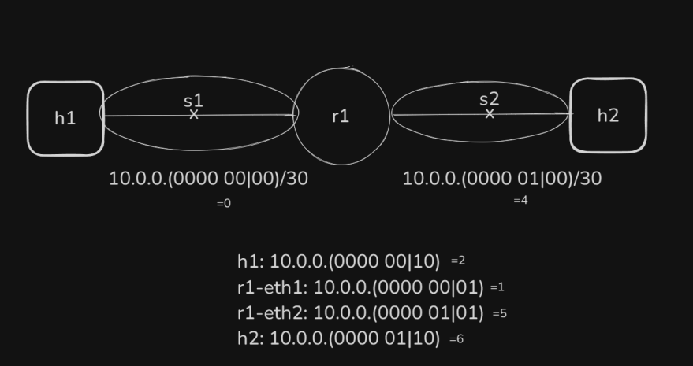

# Visualizacion de Fragmentacion

Se confecciono un *script de python* que inicializa una topologia con
dos hosts, dos switches y un nodo central tomando el rol de Router.
Para esto se configura al nodo para que pueda hacer ip-forwarding (esto lo hara comportarse
como router). A su vez el *link* entre el router y el segundo switch tiene un packet loss de 10%.

La asignacion de ips internas que estan en el script se hizo con las ips justas y necesarias
para las dos subnets (1 host + 1 router-itf + 1 ip red + ip broadcast,
para ambos lados). Esta asignacion se puede visualizar en el siguiente diagrama:



Finalmente, el MTU se configura para ser mas bajo de un lado que otro, esto es para evitar
que la fragmentacion ocurra en los hosts. El MTU bajo (600) es el de la interfaz 2 del router,
y la de la interfaz 1 del mismo se mantiene en 1500 (que es el *default* en mininet),
esto permite mandar packets que pasen el primer mtu pero cuando el router lo quiera pasar por la otra interfaz
tendra que fragmentar. Es decir que con esta topologia se debe generar un flujo de packets de `h1 -> h2`
para ver correctamente la fragmentacion hecha en el router.

### Como ejecutar

Para crear esta topologia en una sesion de mininet, se ejecuta el script de la siguiente forma:

```bash
python3 ./mininet/fragmentation/frag_topo.py
```

Una vez en mininet, se puede generar flujo de packets TCP o UDP con los siguientes comandos:

```bash
mininet> h2 iperf -s & # Abrir servidor en h2

# Enviar mensajes desde h1 con tamaño menor al MTU
mininet> h1 iperf -c h2 -l 1400 [-t SECONDS] [-u]
```

Luego si se quiere utilizar *wireshark* para capturar los packets, se debe ver la interfaz 1 de ambos switches
(las interfaces del router no son visibles a OVSwitch). En la interfaz Switch1-1 se veran los packets antes
que lleguen al router, tal cual los envia el host 1, y en la interfaz Switch2-1 se veran los packets cuando
salen del router y se dirijen al host 2.
